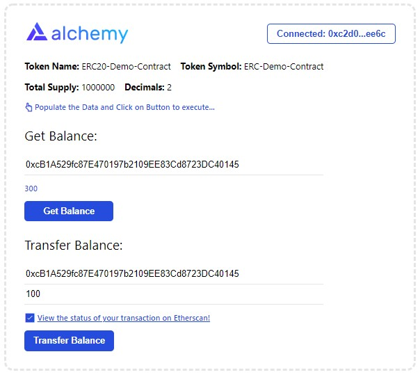

# Smart Contract Alchemy Sample UI Tutorial

This project is referred from [Alchemy's Hello World Part 4](https://docs.alchemy.com/alchemy/tutorials/hello-world-smart-contract/creating-a-full-stack-dapp), which teaches how to create a full stack dApp by connecting your smart contract to a React frontend using Metamask and Web3 tools.

_Note: I am not a UI developer, so there could be issues in the UI. This project only shows how you can use the Alchemy Starter Files and create your own customized UI using alchemy web3.js_

# Installation
To use this dApp, you'll need to do the following:

1. Run `yarn install` to download the `node_modules` folder.
2. Download the [dotenv package](https://www.npmjs.com/package/dotenv) in your project directory by running `yarn install dotenv --save` in your terminal
3. Create a `.env` file in the UI root directory and then add your [Alchemy API Key](https://docs.alchemy.com/alchemy/tutorials/hello-world-smart-contract/creating-a-full-stack-dapp#establish-an-api-connection-to-the-ethereum-chain). Thus `.env` file would look like:

```
REACT_APP_ALCHEMY_KEY = https://eth-ropsten.ws.alchemyapi.io/v2/<key>
REACT_APP_CONTRACT_ADDRESS=<deployed contract address>
```
4. Setup Contract ABI which you would get after compiling the Smart Contract. For simplicity, the ABI for the Smart Contract has been configured. 
5. Run `yarn start`in your terminal to open the dApp in your browswer at `http://localhost:3000/`.

# Using the UI 

## Connect Wallet

It is expected that you have configured a Wallet Extension in the browser. For our use case, I used MetaMask wallet which can be downloaded from [MetaMask Download Page](https://metamask.io/download.html)

## Get Balance & Transfer Balance

Any user can Get Balance without connecting to a wallet. For Transferring Coins, only owner who deployed the smart contract can transfer the coins. Below is how the UI would look like

